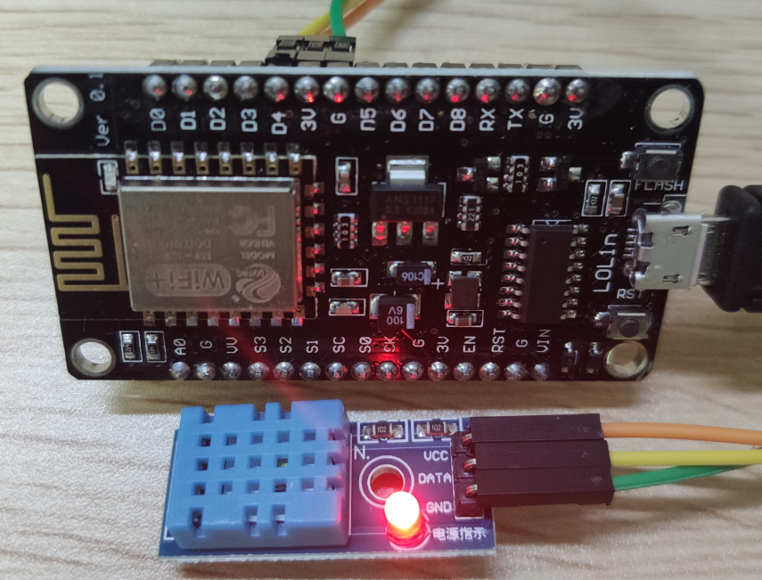

# esp8266-dht11
> esp8266 dht11 sample
>
> esp8266+dht11 温湿度读取


 


```
#运行后输出如下
esp8266读取DHT11传感器数值
串口会分别打印当前湿度（%），当前摄氏度温度，当前华氏度温度和当前开式温度 
DHT11库文件版本: 0.4.1


当前湿度( % ): 0.00
当前温度( ℃ ): 0.00  
当前温度( ℉ ): 32.00 
当前温度( K ): 273.15


当前湿度( % ): 60.00
当前温度( ℃ ): 22.00
当前温度( ℉ ): 71.60 
当前温度( K ): 295.15
```


## ESP8266开发板

ESP8266 NodeMCU 


**开发板USB驱动**

> 我的这块板是CH340G的，windows10可以自动安装驱动，如果不能自动安装请下载下面的文件安装 

安装文件: [CH341SER.7z](assets\CH341SER.7z) 


## 连线

| DHT11          | ESP8266       |
| -------------- | ------------- |
| S(信号线) DATA | D4引脚  GPIO2 |
| +(电源) VCC    | 3v3           |
| -(电源) GND    | GND           |


## 运行

- 如果开发板与我的相同，下载项目源码直接使用vscode(PlatformIO)打开即可

- 如果不同开发板,只要是esp8266的代码也能通用，新建项目时请根据实际芯片型号配置

  我这里选择NodeMCU 1.0(ESP-12E Module)


